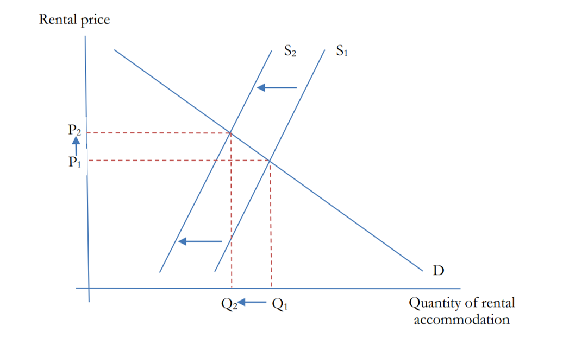

```{r setup, include = FALSE}
knitr::opts_chunk$set(echo = TRUE)
library(tidyverse)
#library(rtweet)
library(ggplot2)
library(ggfortify)

```

## Background
Minister Williams mentioned rent controls on national TV on 3rd February: 
https://www.newshub.co.nz/home/politics/2022/02/associate-housing-minister-poto-williams-floats-rent-controls-as-cost-of-living-bites.html creating an interest peak on the topic, both in media and social media: 

```{r twitter_plot, echo = FALSE}

rt <- readRDS('tweets.rds')

data <- rt %>%
        mutate(day_only = strsplit(as.character(created_at), ' ') %>% map_chr(.,1)) %>%
        group_by(day_only) %>%
        summarise(n = n()) %>%
        mutate(day_only = as.Date(day_only))


ggplot(data, aes(x = day_only, y = n)) +
  geom_line() +
  geom_point() +
  theme_bw() +
  xlab('Date') +
  ylab('n') +
  ggtitle("Number of daily tweets with the keywords \'NZ rent controls\'")

```


## Political views on rent controls
Rent controls, as all market interventions, are controversial and spike public and expert's debate. Economists views on rent controls are unsurprisingly related to their ideological standpoints. In New Zealand, this is the current view on the topic.

**Current Government (Labour Party)**:
Earlier in the term, Minister Robinson said rent controls weren't on the table: https://www.nzherald.co.nz/nz/government-has-no-plans-to-implement-rent-control-policy-robertson-says/WZ3NRLYL3KDZBQEOQHQSSCRWFQ/
however, Associate Housing Minister Williams, floated the idea in a public appearance last week. 


**In favour of rent controls:**
NZ Green Party rent controls proposal https://d3n8a8pro7vhmx.cloudfront.net/beachheroes/pages/14651/attachments/original/1620018442/Reasonable_Rents_-_Green_Party_Discussion_Document.pdf?1620018442

Renters United: https://www.rentersunited.org.nz/rentcontrolsnow/

**Against rent controls:** 

National party calls them 'draconian': https://www.national.org.nz/kiwis-paying-the-price-for-failed-housing-policy

David Law from The New Zealand Initiative's paper against them https://www.nzinitiative.org.nz/reports-and-media/reports/research-note-rent-controls-the-next-mistake-in-new-zealands-approach-to-housing-policy/
The New Zealand Initiative is a free-market think tank. 

## What are rent controls
Rent controls is a broad term that is used to define a range of specific policy measures aimed at limiting or controlling private market rents in an area. 
In general, a rent control is a mechanism by which a government (often at a local/city level) sets the maximum price or maximum allowed rent increase of private market rents. 

Rent controls have been applied in different places in the world and they cannot be understood in isolation of the housing markets where they operate. 
A consideration of how these controls are applied is whether the rents are controlled between tenancies, within tenancies, or fixed for a specific time period. 

Another important consideration is what mechanism is used to decide the 'initial' rent. Common mechanisms are: a) Rent market based: Initial rents are linked to the rental market, b) Points system: Model attempts to capture value without using market prices as starting point, using a measure of 'utility', c) Landlord cost-based:Model sets rents based on landlords' running costs, d) Property value: Model uses a proportion of property value to determine maximum rent. 

Each one of these mechanisms are likely to have different effects on overall housing supply. 

## Risks of rent controls

### Decrease in the supply of rental accommodation
When looking at rent controls using a simple supply and demand analysis of the rental market, it becomes apparent that increasing costs for landlords mean that at any given rental price, landlords will have higher costs and less benefits from renting and less rental accommodation will be offered to the market. In turn, that will drive higher rents and increase the competition between renters. 

```{r supply_dmeand, out.width = '60%', echo = FALSE}


```

Counter arguments to this analysis are:

- The rental market does not operate in isolation from the broader housing market. When a landlord decides to take out a house from the renal market, that house could become available for sale. That will allow some renters to become home owners, thus pushing the demand for rentals back down. This could translate in a higher number of houses available for sale, thus pushing house sale prices down. However, we do not fully understand how that mechanism works. We cannot estimate the number of households that being able to purchase a house, remain in renting situations. Data from the 2008 Survey of Family, Income and employment points at 31% of those renting could afford to service a mortgage on a lower-quartile priced house without payments exceeding 30% of their gross income. 

- Rent regulations can contain provisions for new building and or major improvements to reduce the disincentivation of housing supply. For example, a provision that states that new property in the market is not affected by the regulations. 

- When a landlord gets an income because of a property that has already paid back its constructions costs, that income is a rent in the economic sense. That is, a payment someone receives from some economic activity because of an exclusive right over it, as opposed to contributing some productive resource. Rents in this sense come from a monopoly and don't contribute real resources to production of housing. Removing economic rents does not have costs in terms of market efficiency. 


### Lower mobility

Tenants in situations of rent controlled tenancies are less likely to move. This has potential for misallocation of housing, that is, families that end up living in small apartments while empty nesters living in large homes with extra bedrooms. Additionally, lower mobility might have effects on the labour market, as people decide to not move to take up better employment opportunities. 

The counter argument here is that from an urban development perspective there might be a social interest for income diversity and stable neighborhoods. It is known that in absence of rent control, ares with rising productivity see sharp rises in rents and it becomes difficult for people holding lower paid jobs to live within commuting distance. 

### Feasibility

Rent controls require an administrative infrastructure to establish the control monitoring and enforcing of the policy. Without it, there is a high risk of negative effects to the wider economy and particularly to housing supply. 


## Benefits of rent controls

Rent regulation has been shown to be effective in limiting rent increases and no evidence has been found of them reducing the overall supply of housing, according to three studies cited in J.W.Mason. 
In addition to their effect on the overall level of rents, rent regulations pay an important role in promoting neighborhood stability and protecting long term-tenants. 


## Key points from a Sytem Intelligence point of view

<style>
div.blue { background-color:#e6f0ff; border-radius: 5px; padding: 20px;}
</style>
<div class = "blue">

- Are we at a point where rent has become unaffordable enough to require rent controls? Nam could you please comment on this based on the rent affordability measures you have been working at? Particularly where we are at income vs rent and also number of households that are owner occupiers vs renters.
- Rent controls need to be understood as a broad housing and urban development policy option and are not going to be useful if used in isolation and only with the idea in mind to increase renting affordability.  
- There are gaps in our understanding of how households transition between tenures. We do not have a good grasp of the number of households that are in renting situations when they could be owner-occupiers. Our models of housing tenure are possibly over simplistic to understand what the effects of a rent control would be on the house market. 
- When the microsimulation model of housing demand (microsim) is embedded in HUD, it will be possible to test the effects of different rent control policies.  
- Theoretical economic analysis of rent controls can become very complex as it needs to take into account how the housing market interacts with other important urban development issues such as labour mobility and transport. 
- Alan and Nam, could you please add here any further thoughts?

</div>

## References

The above information comes from these three analyses of rent controls:

```{r hannah, echo = FALSE, out.width = '10%'}

```


(2019) Hannah Wheatly from New Economics Foundation analysis on options for rent controls on the city of London: 
https://neweconomics.org/uploads/files/NEF_RENT-CONTROL_WIP3.pdf


```{r david, out.width = '10%', echo = FALSE}


```

(2021) David Law from The New Zealand Initiative's report called 'Research note on rent controls, the next mistake in New Zealand's approach to housing policy': https://www.nzinitiative.org.nz/reports-and-media/reports/research-note-rent-controls-the-next-mistake-in-new-zealands-approach-to-housing-policy/

```{r jwmason, out.width = '10%', echo = FALSE}

```

(2019) J.W.Mason's blogpost and testimony before Jersey City's city council. https://jwmason.org/slackwire/2019/11/


